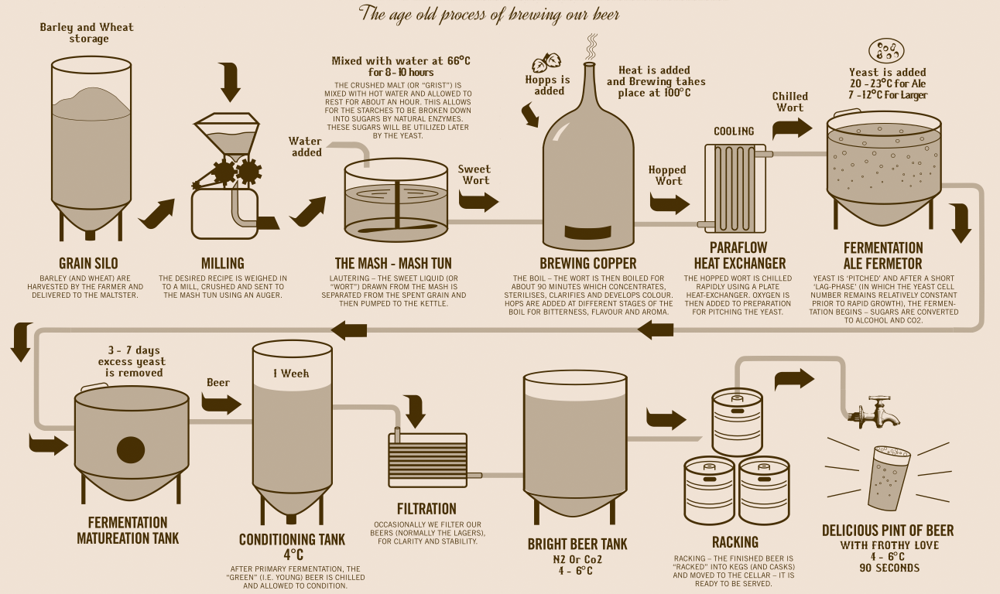

# GolangWikiParser

Welcome to my introduction to Golang. This project's goal is to demonstrate how a **pipeline** can be realized in Golang using some its provided features.

## The Pipeline

So what is a pipeline? As [Wikipedia](https://en.wikipedia.org/wiki/Pipeline_(software)) blissfully puts it:

> A pipeline consists of a chain of processing elements (processes, threads, coroutines, functions, etc.), arranged so that the output of each element is the input of the next.

In short, a pipeline is just a system where data is moved from module to module until finally reaching the end.

Imagine a software pipeline as a physical pipeline system like this brewery:

The goal of the brewery is to transport the ingredients from one section to another until we finally have beer.

So how does this relate to the software pipeline?

## The Tools

What does Golang provide to make this pipeline happend?

### Channels

Brief explanation about channels and why they're helpful. Note that Garret talks about this.

### Goroutines

Brief explanation about goroutines and why they're helpful. Note that Garret talks about this.

A goroutine is ____. It's helpful because of ____.

### Fan Out

Fan Out isn't a concrete tool like channels and goroutines, but is more or less a method of processing data that is available because of the aforementioned tools.

Let's look back at our beer example. The fermentation process takes a long time, so that's sort of our bottleneck.
We can speed things up by feeding the contents of the fermenter into multiple fermentation tanks.

This is the idea of "fanning out". We now have multiple modules that read from the same input.
In software speak, this is equivalent of using available cores to run the processes in parallel.
Let's see how this is used in our demo:

CODE SNIPPET, USE CODE BRACKETS FOR MARKDOWN, NOT AN IMAGE LINK

### Fan In

Brief explanation about fan-in and why it helps the pipeline.

Looking back our our beer example, we can start "fanning in" the contents of the fermentation tank.
We can do this by let a single conditioning tank pull the contents of multiple fermentation tanks.
Let's see how this is used in our demo:

CODE SNIPPET, USE CODE BRACKETS FOR MARKDOWN, NOT AN IMAGE LINK

### Range

Brief explanation about how range is used to read from channels.

## The Problems

Help! There's a leek in my boat!